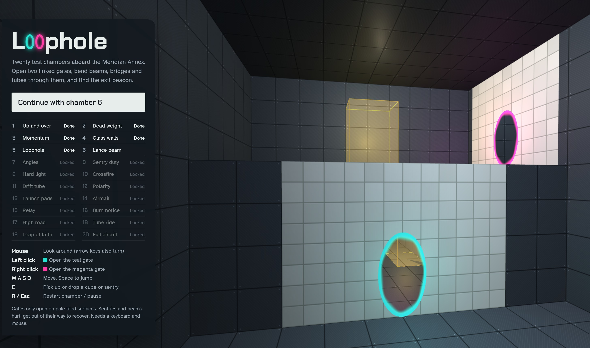

# Loophole

A first-person portal puzzle game that runs in your browser from a single HTML file.

You are a test subject aboard the **Meridian Annex**, a derelict orbital lab, and a dry-witted custodian AI named **HALCYON** comments on your progress. Open two linked gates, carry your momentum through them, and bend light beams, bridges and tubes through them to reach the exit beacon of each test chamber.

Loophole is an original game inspired by the portal-puzzle genre. It is not affiliated with or endorsed by Valve, and it uses none of Valve's characters, names, story or artwork.



## Running the game

1. Download `loophole.html`.
2. Open it in a current desktop version of Chrome, Firefox or Edge. Double-clicking the file works; you don't need a web server.

The first load needs an internet connection, because the page fetches two things from public CDNs:

- **Three.js r128**, the 3D engine, from `cdnjs.cloudflare.com`.
- **Fonts** (Chakra Petch and Atkinson Hyperlegible) from Google Fonts.

### Playing fully offline

1. Download `three.min.js` (version 0.128.0) into the same folder as `loophole.html`.
2. In `loophole.html`, change the one `<script src="https://cdnjs.cloudflare.com/...three.min.js">` line to:
   ```html
   <script src="three.min.js"></script>
   ```

Without the web fonts, the game falls back to system fonts and plays normally.

### Requirements

- A browser with WebGL.
- A keyboard and mouse.

## Controls

| Input | Action |
|---|---|
| Mouse | Look around (arrow keys also turn) |
| Left click (or Q) | Open the teal gate |
| Right click (or F) | Open the magenta gate |
| W A S D | Move |
| Space | Jump |
| E | Pick up or drop a cube or sentry |
| R | Restart the chamber |
| Esc or P | Pause |

Click the game view to capture the mouse. Press Esc to release it.

## Puzzle elements

- **Gates.** Two linked openings. Anything that enters one leaves the other, keeping its speed, so falling into a floor gate can fling you out of a wall gate.
  - Gates only open on pale tiled surfaces.
  - Metal and glass reject them.
- **Cubes and plates.** A cube, or you, standing on a floor plate opens the doors linked to that plate.
- **Slag.** Molten floor hazard. It is fatal to you; a cube that falls in is replaced.
- **Lance beam.** A hot, straight laser.
  - It passes through gates and glass, and hurts you if you stand in it.
  - It powers **catchers**, which open doors.
  - It destroys sentries.
- **Prism cube.** Redirects a lance beam in the direction its pointed face is facing. It turns in 45° steps when you set it down.
- **Sentry.** Fires at you whenever it can see you, within its range and field of view.
  - A carried cube blocks its view.
  - It stops working once it is knocked over or picked up.
- **Hardlight span.** A bridge made of light that you can walk on.
  - It bends through gates.
  - Coming out of a floor gate, it stands up as a wall.
- **Drift tube.** A tractor tube that carries you and objects at walking pace.
  - It bends through gates.
  - Some floor plates reverse its direction.
  - Step sideways to leave it.
- **Launch pad.** Throws anything that lands on it along a fixed arc, including straight up.

### Health

Sentries and lance beams drain your health, and the screen edges glow orange as it drops. If you get out of harm's way, you recover within a couple of seconds.

## Chambers

| # | Name | Introduces |
|---|---|---|
| 1 | Up and over | Gate basics |
| 2 | Dead weight | Cubes, plates, doors |
| 3 | Momentum | Flinging through gates, slag |
| 4 | Glass walls | Surfaces that reject gates |
| 5 | Loophole | Combined gate skills |
| 6 | Lance beam | Beams through gates, catchers |
| 7 | Angles | Prism cube |
| 8 | Sentry duty | Sentries, cube as a shield |
| 9 | Hard light | Hardlight span |
| 10 | Crossfire | Flanking sentries with gates |
| 11 | Drift tube | Drift tube |
| 12 | Polarity | Reversing a tube |
| 13 | Launch pads | Launch pads |
| 14 | Airmail | Launching a cube |
| 15 | Relay | Two beams, one door |
| 16 | Burn notice | Beam from a ceiling gate against a sentry |
| 17 | High road | Walking a span through a gate |
| 18 | Tube ride | Tube there, gate back |
| 19 | Leap of faith | Pad into a ceiling gate |
| 20 | Full circuit | Beam, sentry and span in sequence |

Chambers unlock in order. From the menu you can replay any chamber you have reached.

## Saved progress

Progress is stored in the browser's `localStorage` under these keys:

| Key | Meaning |
|---|---|
| `loophole.unlocked` | Highest chamber reached |
| `loophole.cleared` | Whether the whole campaign is finished |
| `loophole.v2` | Marks that progress from the earlier five-chamber version has been carried over |

- Progress belongs to one browser and one file location. A copy opened from a different folder, or in a different browser, starts again at chamber 1.
- If you finished the original five-chamber version, chamber 6 unlocks automatically.
- To reset progress, clear the site data for the page in your browser settings.

## How it works

Everything lives in one self-contained HTML file: markup, styles and one JavaScript module built on Three.js. The only external files are Three.js and the web fonts. Textures are drawn procedurally on canvases, and all sound effects are synthesized with the Web Audio API.

- **Gate rendering.** Each gate is rendered to a texture from a virtual camera, recursively up to 3 levels deep. An oblique near-plane clip keeps geometry behind the gate out of view.
- **Physics.** Players and objects are axis-aligned boxes, moved in sub-steps.
  - Solid geometry directly behind an open gate is ignored, so bodies can pass through.
  - A body is teleported when its centre crosses the gate plane inside the gate frame. Its position, velocity and facing are transformed to the other gate, with a minimum exit speed.
- **Beams, spans and tubes.** One ray-tracing routine handles all three, following each one through gates and prisms up to a fixed number of bounces. Hardlight spans become temporary solid boxes each frame, so you can stand on them.
- **Signals.** Plates and catchers emit named signals. A door opens only when every source sharing its signal name is active. Tubes and spans can listen to signals too, to reverse direction or switch on.
- **Levels.** Each chamber is described in a small built-in level language:

  | Command | Places |
  |---|---|
  | `room`, `box`, `panel` | Rooms, solid blocks, gate-friendly wall panels |
  | `goo` | Slag |
  | `door`, `button` | Doors and floor plates |
  | `cube`, `prism`, `sentry` | Carryable objects |
  | `laser`, `catcher` | Lance beams and catchers |
  | `bridge`, `funnel`, `pad`, `padV` | Hardlight spans, drift tubes, launch pads |
  | `exitDoor`, `spawn`, `light` | Exits, player start, lighting |

  Each chamber also carries its own HALCYON lines.

### Adding a chamber

Append an entry to the `LEVELS` array in `loophole.html`:

```js
{
  name: 'My chamber',
  intro: ['A line HALCYON says on entry.'],
  outro: 'A line HALCYON says on completion.',
  build(L) {
    L.room(0, 0, 0, 12, 6, 10, { px: 'none' });  // room with an open +x wall
    L.exitDoor('+x', 12, 5, 0, null, -1, 11, 7); // exit alcove in that wall
    L.panel('+x', 0, 0, 3.2, 3, 7);              // gate-friendly panel on the -x wall
    L.spawn(3, 0, 5, -Math.PI / 2);              // start facing +x
    L.light(6, 5.5, 5, 0xdbe8ff, 0.9, 16);
  }
}
```

Coordinates are in metres, and y points up. A panel takes the wall normal, the wall position, and two ranges along the wall surface.

## Credits

- Game design, code and writing: an original work made with Claude (Anthropic).
- 3D engine: [Three.js](https://threejs.org/) (MIT licence).
- Fonts: Chakra Petch and Atkinson Hyperlegible, via Google Fonts (SIL Open Font License).
